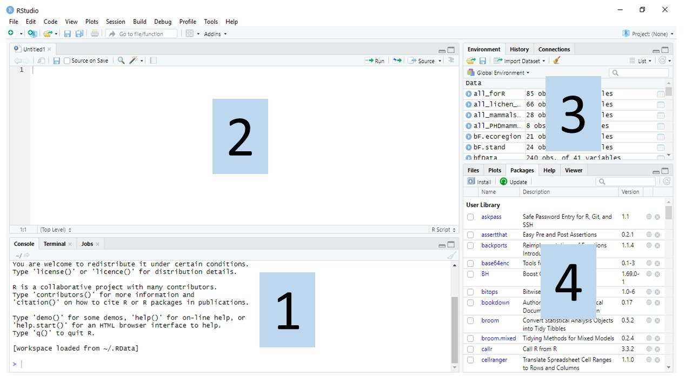
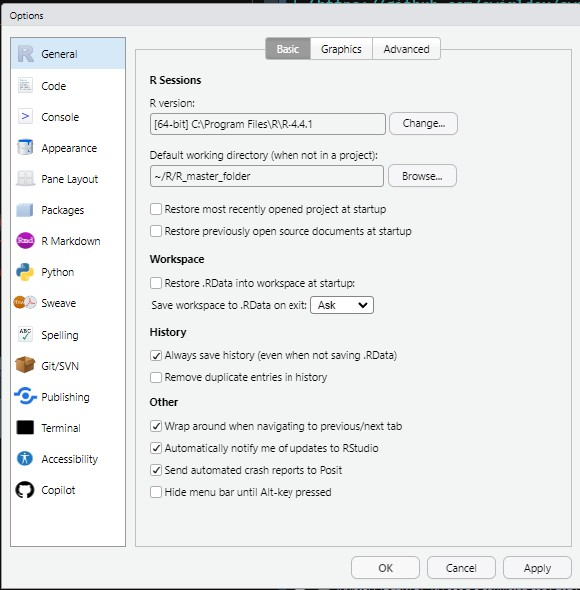
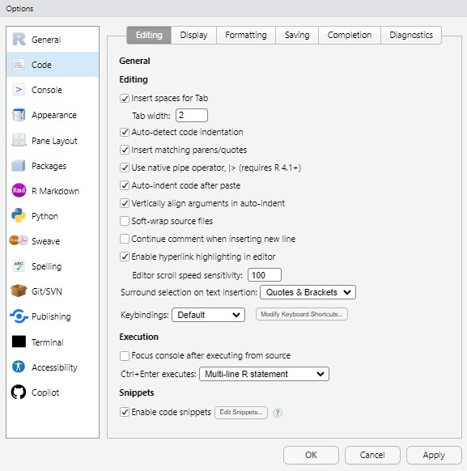

Install in this order. R first, then RStudio, then Quarto (Tinytex is optional but recommended).

## 1. R

R is the language and the engine. It has almost no user interface of its own.

| Platform | Download | Notes |
|------------------------|------------------------|------------------------|
| Windows | [CRAN Windows](https://cran.r-project.org/bin/windows/base/) | Also install [Rtools](https://cran.r-project.org/bin/windows/Rtools/), needed to compile some packages |
| macOS | [CRAN macOS](https://cran.r-project.org/bin/macosx/) | Pick the **arm64** build for Apple silicon (M1–M4), **x86_64** for Intel |
| Linux | [CRAN Linux](https://cran.r-project.org/bin/linux/) | Use the CRAN repository, not your distribution's default: distro versions lag badly |

We will use **R 4.4.0 or newer**. Older versions will mostly work but the native pipe `|>` requires 4.1+, and we use it everywhere.

## 2. RStudio

RStudio is the workbench: an editor, a console, a file browser, and a plot pane in one window.

Download **RStudio Desktop (free)** from [posit.co/download/rstudio-desktop](https://posit.co/download/rstudio-desktop/).

::: callout-note
## Positron?

Posit's newer editor, Positron, is excellent, but the workshop demos, keyboard shortcuts and screenshots all assume RStudio. Use RStudio for these two days and explore Positron afterwards.
:::


## 3. Quarto

Quarto turns your code and prose into documents, slides and websites. RStudio bundles a copy, but install the standalone version so you get the current release and a working command line.

Download from [quarto.org/docs/get-started](https://quarto.org/docs/get-started/).

## 4. A LaTeX engine (only if you want PDF output)

PDF rendering needs LaTeX. Do **not** install a full TeX Live distribution (several GB). Instead, from the R console:

``` r
install.packages("tinytex")
tinytex::install_tinytex()
```

This installs a \~200 MB LaTeX that Quarto knows how to use. HTML and Word output need none of this. Skip it if you are short on time or disk.

## 5. Confirm everything is talking to everything

Open RStudio. You will probably see something like this. RStudio has 4 windows (also known as "panes") that are inter-linked.

1\. Console pane, where code is executed by R.

2\. Source pane, to work with R scripts (code won’t be evaluated until you send it to the
console).

3\. Environment/History pane, to view objects in the working space and command history, respectively.

4\. Files/Plots/Packages/Help pane, to see the file directories, plots, installed packages and access R help, respectively.

> The first time you open `RStudio` you may not see the top left pane (the Source pane, labeled 2 in the figure below). To make it visible, use your mouse to select `File -> New File -> R Script`



Two of the three checks below ask R about a program outside R, and each needs a small helper package that a fresh RStudio does not ship with. Install both first. In the **Console** pane (bottom left), type this and press <kbd>Enter</kbd>:

``` r
install.packages(c("rstudioapi", "quarto"))
```

Then type each line and press <kbd>Enter</kbd>:

``` r
R.version.string
#> "R version 4.6.1 (2026-06-24)"

rstudioapi::versionInfo()$version
#> '2026.08.0'

quarto::quarto_version()
#> '1.10.18'
```

::: {.callout-important}
## `there is no package called 'rstudioapi'` or `'quarto'`
You skipped the `install.packages()` line above. Run it, then try again. The error is about the helper package, not about RStudio or Quarto themselves.
:::

If `quarto::quarto_version()` still errors after installing the package, RStudio cannot see Quarto on your `PATH`. Restart your computer (genuinely, this fixes it most of the time). If it survives a restart, check whether Quarto is installed at all by asking the command line instead:

``` r
system("quarto --version")
```

A version number means Quarto is installed and only R cannot find it: see [Troubleshooting](../resources/troubleshooting.qmd). No version number means Quarto is not installed: go back to step 3.

## 6. Set up an RStudio project {#projects}

This is the habit that separates reproducible work from the alternative. A **project** is a folder plus an `.Rproj` file that tells RStudio "this folder is the root of the world".

1.  **File → New Project → New Directory → New Project**
2.  Directory name: `meded-conclave-2026`
3.  Put it somewhere you can find it, but **not** inside a folder synced to OneDrive/Google Drive if you can avoid it (sync conflicts corrupt R sessions).
4.  Tick *Open in new session*. Click **Create Project**.

Inside that folder, create three subfolders. From the R console:

``` r
dir.create("data")
dir.create("R")
dir.create("output")
```

Your project should now look like this:

```         
meded-conclave-2026/
├── meded-conclave-2026.Rproj    <- double-click this to open the project
├── data/                        <- the workshop datasets go here
├── R/                           <- your scripts
└── output/                      <- figures and rendered documents
```

::: callout-important
## Four settings to change now

**Tools → Global Options → General**

-   Untick **Restore most recently opened project at startup**
-   Untick **Restore previously open source documents at startup**
-   Untick **Restore .RData into workspace at startup**



**Tools → Global Options → Code**

-   Tick **Use native pipe operator, \|\> (required R 4.1+)**



Why the first three: if R silently restores yesterday's objects, your script
"works" for reasons that have nothing to do with your script. Starting from a
clean session every time is what makes your analysis reproducible.
:::

## 7. Never use `setwd()`

Because you opened a project, R's working directory is already the project folder. Refer to files with paths relative to it:

``` r
# Good: works on any machine
readr::read_csv("data/meded_students.csv")

# Better: using the `here` package
readr::read_csv(here::here("data", "meded_students.csv"))

# Bad: works only on your laptop, on Tuesdays
setwd("C:/Users/Priya/Desktop/stuff")
readr::read_csv("meded_students.csv")
```

If you send someone the project folder, the first two versions run. The third does not.

## Next

→ [Check your setup](check-setup.qmd): install the packages and run the verification script.
